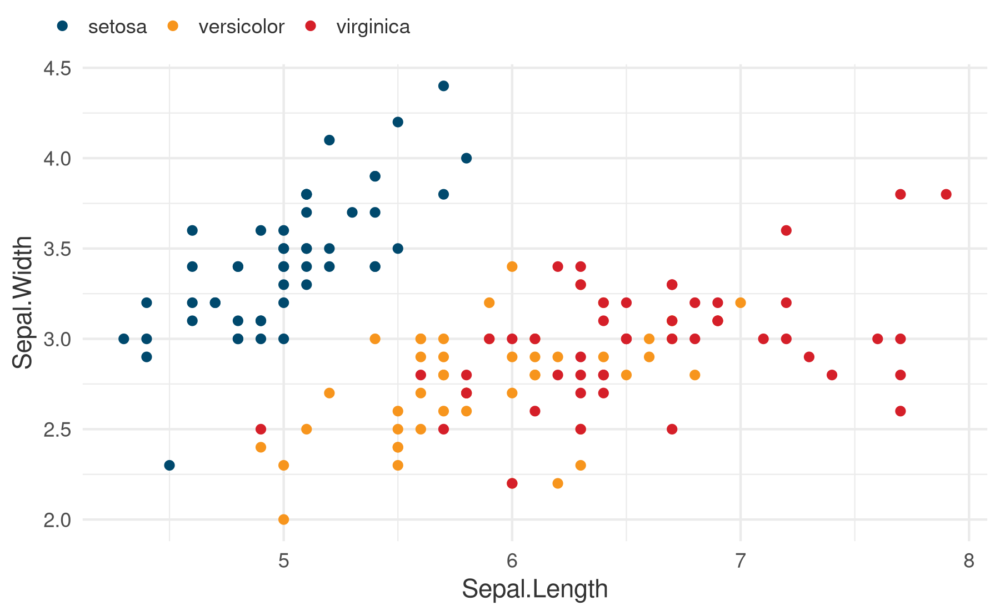

<!-- README.md is generated from README.Rmd. Please edit that file -->

# obsplot 

<!-- badges: start -->

[](https://github.com/pabsantos/obsplot/actions/workflows/R-CMD-check.yaml)

<!-- badges: end -->

The goal of `obsplot` is to provide ggplot theme and color elements to
help create graphics in the style of the [Observatório Nacional de
Segurança Viária](www.onsv.org.br).

## Overview

This package provides two main functions and a palette of colors:

- `theme_obs()`: Apply the ONSV theme to a ggplot object;
- `scale_discrete_obs()`: Apply the ONSV color palette to a ggplot
  object;
- `obs_palette`: A data object which provides the full palette of
  colors, including its hex codes.

## Installation

You can install the development version of `obsplot` like so:

``` r
remotes::install_github("pabsantos/obsplot")
```

## Example

This is a basic example which shows you how to apply the functions
included in this package. First, a basic ggplot graphics:

``` r
library(obsplot)
library(ggplot2)

plot1 <- ggplot(data = iris, aes(
  x = Sepal.Length, y = Sepal.Width, color = Species
)) +
  geom_point()

plot1
```


Then, apply `theme_obs()` to change the theme of the plot and
`scale_discrete_obs()` to change the colors:

``` r
theme_set(theme_obs())

plot1 + scale_discrete_obs()
```



If only one color is necessary in the plot, it is possible to use one of
the colors included in the `obs_palette` object;

``` r
str(obs_palette)
#> List of 12
#>  $ blue       : chr "#00496d"
#>  $ yellow     : chr "#f7951d"
#>  $ red        : chr "#d51f29"
#>  $ green      : chr "#1fa149"
#>  $ pink       : chr "#ec0d6b"
#>  $ orange     : chr "#f05f22"
#>  $ lightblue  : chr "#99B6C5"
#>  $ lightyellow: chr "#FCD5A5"
#>  $ lightred   : chr "#EEA5A9"
#>  $ lightgreen : chr "#A5D9B6"
#>  $ lightpink  : chr "#F79EC4"
#>  $ lightorange: chr "#F9BFA7"
```

applying directly to the `color` or `fill` of the `geom:`

``` r
ggplot(data = iris, aes(x = Sepal.Length, y = Sepal.Width)) +
  geom_point(color = obs_palette$yellow)
```


## Citation

If you want to cite this package, you can cite as:

    #> To cite package 'obsplot' in publications use:
    #> 
    #>   Santos PAB (2023). _obsplot: Apply ONSV Style for Ggplot Graphics_. R
    #>   package version 0.1.2, <https://www.github.com/pabsantos/obsplot>.
    #> 
    #> A BibTeX entry for LaTeX users is
    #> 
    #>   @Manual{,
    #>     title = {obsplot: Apply ONSV Style for Ggplot Graphics},
    #>     author = {Pedro Augusto Borges Santos},
    #>     year = {2023},
    #>     note = {R package version 0.1.2},
    #>     url = {https://www.github.com/pabsantos/obsplot},
    #>   }
